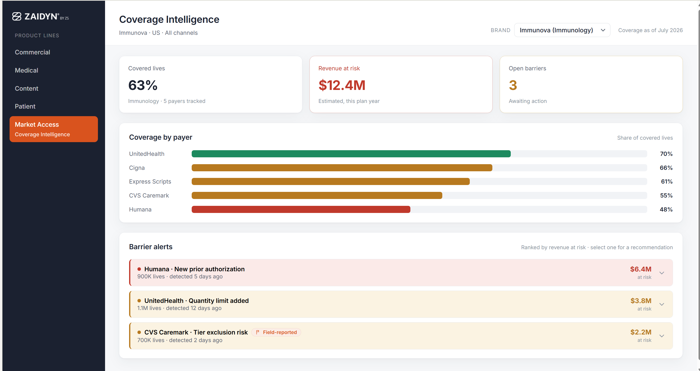
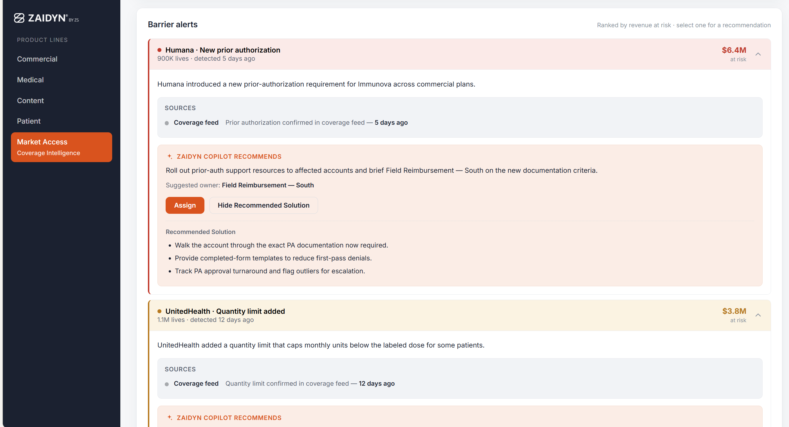

# ZAIDYN Market Access — Coverage Intelligence (Prototype)

A clickable prototype of the **Coverage Intelligence** module, the first module in a proposed new **ZAIDYN Market Access** product line. It shows a market-access team a brand's payer coverage at a glance, surfaces emerging access barriers, quantifies the revenue at risk, and has a Copilot recommend the pull-through action to take.





---

## ⚠️ Read this first: the data is illustrative

**Every number, payer, brand, and barrier in this prototype is invented for demonstration.** It is not real payer, coverage, or revenue data, and the app is not connected to any live data source or external service. The intent is to show the *interface and the workflow*, not to report real coverage. Nothing here should be presented as actual market data.

(The dashboard itself intentionally carries no "demo" or "live" badge — it reads as a finished product. This README is where the "it's mock data" disclosure lives.)

---

## What it demonstrates

- **Coverage at a glance** — covered lives, revenue at risk, and open barriers as headline tiles.
- **Coverage by payer** — a share-of-covered-lives bar per payer, colour-coded by health.
- **Barrier alerts** — the coverage changes that put revenue at risk, ranked by dollar impact.
- **The Copilot moment** — selecting a barrier reveals a recommended pull-through action, a suggested owner, and ready-to-use talking points.
- **Two data sources, reconciled** — each barrier shows where the signal came from (the bought coverage feed vs an internal field report), with dates. When a field report runs ahead of the feed, it's flagged as an early warning rather than silently overwritten.

## What is intentionally stubbed (and why)

This is a one-week demo build. The rule was: *fake the data and the back-end; make only the interface and the one AI interaction real.* So:

| Area | In the prototype | In the real product |
|---|---|---|
| Coverage data | Hand-authored in `data.js` | Licensed feed (e.g. MMIT / Norstella) mapped to the client |
| Copilot recommendation | Pre-written per barrier in `data.js` | Live model call via a backend/proxy (see below) |
| "Assign" button | Shows a confirmation toast only | Routes the action to the owner and tracks status |
| Revenue at risk | Simple stated estimate | Modelled from claims / real-world data |
| Audit trail, roles, permissions | Not included | Platform governance layer |

None of the stubbed pieces are needed to tell the story in a demo.

---

## Run it locally

It's plain HTML/CSS/JS with no build step. Either:

- **Simplest:** open `index.html` in a browser. (The Google Font falls back gracefully if offline.)
- **Recommended** (so relative paths and the logo load cleanly):
  ```bash
  cd zaidyn-access-dashboard
  python3 -m http.server 8000
  # then open http://localhost:8000
  ```

## Deploy to GitHub Pages

1. Create a repo and push the contents of this folder to the root (so `index.html` is at the repo root).
   ```bash
   git init
   git add .
   git commit -m "ZAIDYN Market Access — Coverage Intelligence prototype"
   git branch -M main
   git remote add origin https://github.com/<you>/<repo>.git
   git push -u origin main
   ```
2. In the repo: **Settings → Pages → Build and deployment → Source: Deploy from a branch**, pick `main` / `/ (root)`, save.
3. Your dashboard will be live at `https://<you>.github.io/<repo>/` within a minute or two.

No server-side code is required — GitHub Pages serves the static files as-is.

---

## File structure

```
zaidyn-access-dashboard/
├── index.html      # page shell: sidebar, top bar, empty containers
├── styles.css      # all styling; brand palette defined at the top as CSS variables
├── data.js         # the mock dataset — EDIT THIS to change anything shown
├── app.js          # renders the data into the page and wires interactions
├── assets/
│   ├── zaidyn-logo.png   # the ZAIDYN by ZS logo
│   └── Preview1.png & Preview2.png      # screenshot used in this README
└── README.md
```

The app is data-driven: `app.js` reads `window.ZAIDYN_DATA` and builds the tiles, bars, and barrier cards at runtime. Change the data, refresh, and the dashboard updates — no code changes needed.

---

## Editing the mock data

Open `data.js`. The shape is one object with `meta` and a list of `brands`. Each brand:

```js
{
  id: "cardiova",              // unique key, used by the brand selector
  name: "Cardiova",
  indication: "Cardiovascular",
  market: "US",
  channel: "All channels",
  coveredLivesPct: 71,         // headline covered-lives tile
  payers: [                    // one bar each, order = display order
    { name: "UnitedHealth", coveragePct: 82 }
    // ...
  ],
  barriers: [                  // one alert card each
    {
      id: "cardiova-esi-step",
      payer: "Express Scripts",
      type: "New step therapy",
      severity: "critical",    // "critical" (red) or "major" (amber)
      livesAffected: 2100000,
      revenueAtRisk: 9200000,  // dollars
      detectedDaysAgo: 3,
      summary: "…",            // one-line description of what changed
      recommendedAction: "…",  // the Copilot recommendation shown on expand
      suggestedOwner: "Field Reimbursement — West",
      talkingPoints: ["…", "…"],
      provenance: {           // where the signal came from
        primary: "field",     // "field" (internal team) or "feed" (bought data)
        fieldNote: "…", fieldDaysAgo: 3,   // internal report (omit if none)
        feedNote: "…",  feedDaysAgo: 16,   // bought-feed status
        conflict: true        // field is ahead of feed → shows the early-warning flag
      }
    }
  ]
}
```

Notes:
- **Tiles reconcile automatically.** A brand's headline *Revenue at risk* and *Open barriers* are computed from its `barriers`, so the tiles always match the list.
- **Coverage bar colours** come from thresholds in `app.js` / `styles.css`: `≥ 70%` green (favourable), `55–69%` amber (watch), `< 55%` red (at risk).
- **Barriers are sorted** by `revenueAtRisk`, highest first.
- Add a brand by adding another object to `brands` — it appears in the selector automatically.

Two brands are included so the selector shows the app is genuinely data-driven:

| Brand | Indication | Covered lives | Open barriers | Revenue at risk |
|---|---|---|---|---|
| Cardiova | Cardiovascular | 71% | 2 | $14.3M |
| Immunova | Immunology | 63% | 3 | $12.4M |

---

## Making the Copilot recommendation *live* later

Right now each recommendation is pre-written in `data.js` so the prototype needs no keys and hosts anywhere. To make it a real model call:

1. Stand up a small backend or serverless function (e.g. a Cloudflare Worker, Vercel function, or a tiny Node service) that holds your API key and forwards a prompt to the model.
2. In `app.js`, replace the block that reads `b.recommendedAction` with a `fetch()` to that endpoint, passing the barrier details, and render the returned text into the `.reco__text` element.
3. **Never put an API key in client-side code** — it would be public the moment you deploy. The key stays on the backend.

The interface is already built for this: the recommendation renders into a single element, so only the source of that text changes.

---

## Design notes

- **Palette** is taken from the logo: navy `#1B2130`, orange `#D9531E`, gray `#A6A9AD`, on a light `#F6F7F9` canvas. Defined as CSS variables at the top of `styles.css`.
- **Logo** sits on the navy sidebar and is inverted to white via CSS so it stays legible; the source file is unmodified.
- **Type** is Inter, with a system-sans fallback.
- **Accessibility:** keyboard-focusable controls with visible focus rings, semantic headings, `aria-expanded` on barrier cards, and reduced-motion support.
- Built as vanilla HTML/CSS/JS on purpose — zero dependencies, nothing to build, trivial to host and hand off.

---

## Where this sits in the bigger picture

This prototype is the demo build described in the Coverage Intelligence PRD. The strategic thesis: ZAIDYN shouldn't try to own payer-coverage data (specialist vendors already do) — its edge is combining that bought feed with the company's own field, patient, and claims data, and driving agentic action. The two-source view in the dashboard (bought feed + internal field report, with conflicts flagged) is the visible tip of that idea: no point solution reselling a feed can connect a coverage change to your specific accounts and patients.
